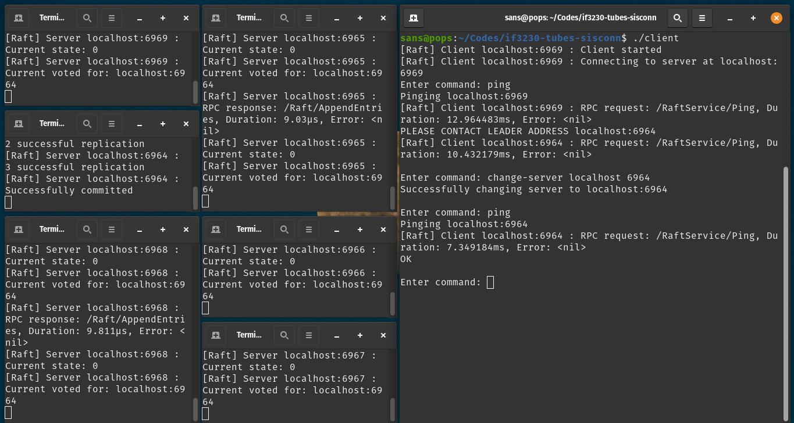

# Raft Protocol

 

## 🏹 Minimum Requirements

- Go 1.22
- Optional : Make

## ✨ How to Run

1. Clone this repository
2. Execute `go mod tidy` on terminal
3. Run Makefile with `make server` to compile server and `make client` to compile client
4. Run server with `./server` and client with `./client` with corresponding ip and port

Alternatively can run scripts in scripts folder to run server and client.

## 📚 How to Use

Here are some of the functionalities of the client:

- ping : to check if the server is alive.
- get `<key>` : to get the value of the key.
- set `<key>` `<value>` : to set the value of the key.
- strln `<key>` : to get the length of the string value of the key.
- del `<key>` : to delete the key.
- append `<key>` `<value>` : to append the value to the key.
- request-log : to get the log entries of the server.
- change-server `<host>` `<port>` : to change the server to connect to.
- help : to get the list of commands.
- start : to start batch transaction.
- exit : to exit the client.
- add-node `<host>` `<port>` : to add a node to the cluster.
- remove-node `<host>` `<port>` : to remove a node from the cluster.

---

## 📝 Contributors

| Nama | NIM |
|------|-----|
| [Yanuar Sano Nur Rasyid](https://github.com/yansans) | [13521110](https://github/noarotem) |
| [Ulung Adi Putra](https://github.com/Ulung32) | 13521122 |
| [Michael Utama](https://github.com/Michaelu670) | 13521137 |
| [Johann Christian Kandani](https://github.com/Genvictus) | 13521138 |
| [Dewana Gustavus Haraka Otang](https://github.com/DewanaGustavus) | 13521173 |
